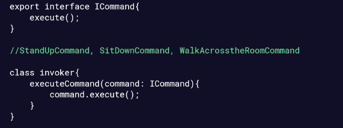
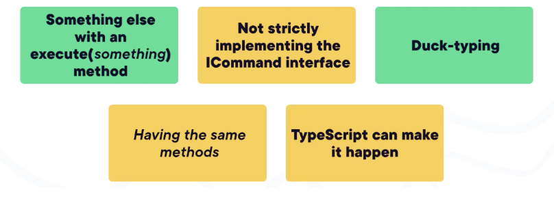

# TypeScript Crash Course for JavaScript Developers

## Understanding TypeScript

### Version Controlling TypeScript and JavaScript
- Compilation vs. Transpilaition
	- The JavaScript emitted from processing TypeScript is at the same level of abstraction as TypeScript
- Version Controlling
	- Version control only the purely non-deterministic elements of the system
- The Solution: A map emitted by the compiler (a sourcemap)

### Does Typing Matter?
- TypeScript CAN enforce strong typing, but only at design type
- Typescript type enforcement happens at compilation time only, and only for TypeScript code

### Debugging TypeScript in the Browser
- The Problem
	- Take interactive debugging for granted in higher level languages
	- The execution engine needs a map of execution to source
- The Solution
	- A map emitted by the compiler – a source map
		- When we compile our ts code we want to emit a source map that would define pointers from the lines of the emitted JS to the TS source

## Exploring Type Annotations and Type Inference in TypeScript

### The TypeScript “Types”
- Primitives: String, Number, Boolean

### Unit Testing and Types
- If it can’t compile, it can’t ship
	- Therefore, statically typed language will prevent real errors from happening at one of the earliest possible moments in the software development cycle
- Consider the purpose of static type checking:
	- Avoiding a class of code defects (bugs)
	- However, this has to be weighed in the context of the larger domain of all code defects

## Generics and Interfaces
- Interfaces: Guarantees that certain methods or properties are in place so that something else can call them in order to get its work done
- What is the difference between an interface and an abstract class
	- Implementation
	- Interfaces can or have code in them
	- Example: ILogger
		- Commonly used interface
		- Used by Globomantics products
		- Two methods: LogEvent and LogException
- Generics help get away from the “any” type
	```typescript
	function write<Type>(arg: Type) {
		// write type-specific stuff
	}
	```
	- Key-Value pair is a primary use case
	- ICommand
		- 
	- You use generics when you want the benefits of typing, but you want to defer the decision about the typing to the other developer
- Duck Typing and Generics
	- 


### Configuration Options***
- tsconfig Files
- Go-tos in TSConfig
	- Target: Is what specific JS target the compiler is going to emit to
	- Module: defines what code will be emitted to make the code available as a module
	- allowJS: JS (files) allowed in TS project removeComments
	- Newline: allows to specify what newline character is emitted when the code is compiled
	- removeComments: dup your comments on the way to JavaScript (usually set to false)
- Strict should always be true
	- Maybe set it to false while straightening out
	- An umbrella option
- Type Declaration Files
